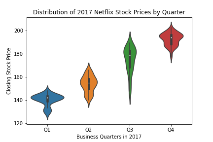
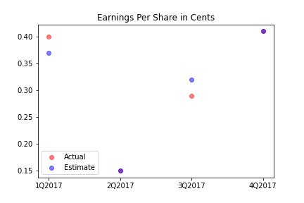
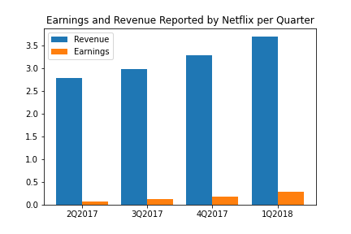
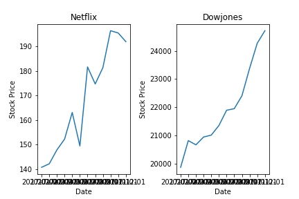

# Data-Visualization-Netflix-Stock-Profile

Thanks to Codeacademy for the amazing project!

The objective here is to practice data visualization and analyze, prepare and plot data with conda installation packages such as pandas, seaborn, matplotlib and jupyter.
With the help of Yahoo's financial database, 4 visualizations have been created. In summary, please find below the visualizations with their interpretation: 

 1. The distribution of Netflix's stock prices for 2017
 
 
 
 This plot allows us to approximately see the distribution of the closing stock price for each quarter.
 In Q1 - 142.00$
 In Q2 - 157.00$
 In Q3 - 182.00$
 In Q4 - 195.00$
 From the results, an upper trend is noticeable in Netflix’s 2017 closing stock price

 2. The actual vs. estimated earnings per share for the four quarters in 2017
 
 
 
 The Earnings per Share, or EPS, generally indicates a company’s profitability.
 The red dot represents the the actual EPS for a given Quarter.
 The blue dot represents the the estimated EPS for a given Quarter.
 The purple dot represents the event where the actual and estimated EPS are equal.

 3. Netflix's earnings and revenue in the last four quarters
 
 
 
 A side-by-side bar graph compares the revenue and earnings for each Quarter
 A trend is noticeable here: both Netflix revenues and earnings are growing with time.
 Setting up the x-axis as well as the bars was a challenge, check out the .py file for steps on how to execute!

 4. A comparison of the Netflix Stock price vs the Dow Jones Industrial Average price in 2017 
 
 
 
 Although the Dowjones stock prices are significantly greater than Netflix’s,
 it is safe to say both companies stock prices increased around 25% for Netflix and around 18% for Dowjones.
 Just by looking at the graph, Netflix’s stock price seems to be more volatile than Dowjones.

 The plots are uploaded as .png files if you wish to take a look at them. Also, you can find the .py as well as the .csv files in the repo.
 
Enjoy!

